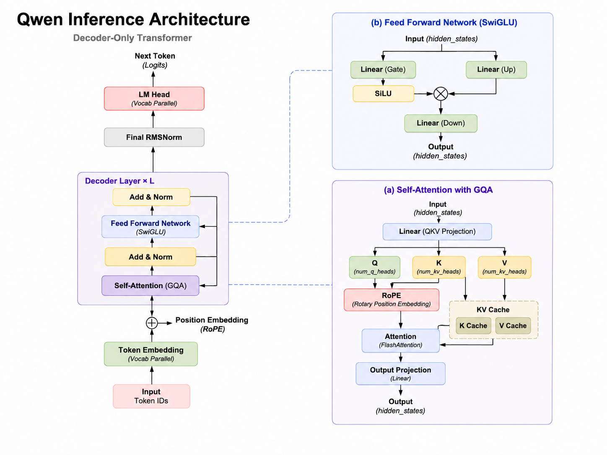
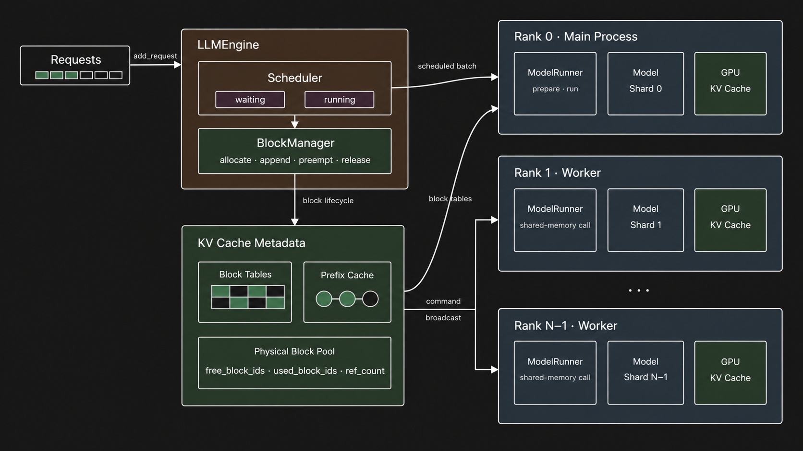
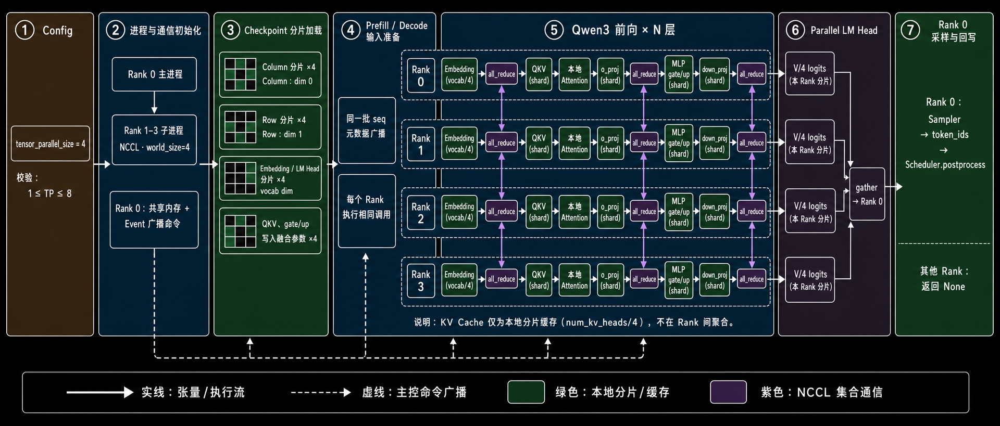

<p align="center">

</p>

# Nano-vLLM-Ext

[English](README.md)

Nano-vLLM-Ext 是一个独立维护的 Nano-vLLM 扩展版本:


### 扩展特性

- Draft–Target 投机解码
- Chunked Prefill（prefill/decode 混批）
- 缓存感知调度（LPM），底层 LRU 前缀缓存支撑

## 架构

### Qwen 推理架构



输入 Token ID 先经过 Token Embedding 与 RoPE，再穿过重复的 Decoder 层，最后由归一化层和 LM Head 生成下一个 Token 的 logits。每个 Decoder 层内，GQA 使用紧凑的 KV Cache 完成注意力计算，SwiGLU 前馈网络则变换隐藏状态。该图展示了这些组件如何串成一条完整的推理路径。

### 引擎与 KV Cache



输入请求从 Scheduler 的 waiting 队列进入 running 队列，并被组装为执行批次。BlockManager 通过每条序列的 block table、物理块池和 Prefix Cache 管理 KV Cache 块的分配、复用与释放。Rank 0 负责协调调度和命令，Worker 则携带相应 block table 执行自己的模型分片。

### 张量并行执行



Checkpoint 权重被拆分到各个张量并行 Rank，其中列并行层和行并行层共同分担模型计算。Prefill 和 Decode 阶段中，每个 Rank 执行本地分片，并在需要合并部分激活值时执行 `all_reduce`。Rank 0 汇聚词表 logits、采样下一个 Token 并返回结果；Worker Rank 只完成分配给自己的分片计算。


## Benchmark

`bench_metrics.py` 在针对每个优化项专门构造的场景下，对比原版引擎与该优化项。每个 `(场景, 变体)` 在独立子进程中运行，确保 GPU 显存在两次运行间完全释放；各场景使用固定随机种子，因此同一场景的所有变体看到完全相同的请求批次。需要 CUDA GPU（实测环境：RTX 5090、Qwen3-0.6B、`max_model_len=4096`）。

```bash
python bench_metrics.py                 # 全部场景、全部变体
python bench_metrics.py prefix          # 仅某一个场景
python bench_metrics.py prefix shared   # 单个变体（子进程内部使用）
```

四个场景，每个隔离一个优化项（原版 vs 优化项）。每张结果表都是基线 vs 优化对比。

### `starvation` —— 混批消除 decode 饥饿

先提交 96 条短请求（输出=2），再提交 96 条长请求（输入 1200–1600）制造连续 prefill。`no_mix`（`enable_chunked_prefill=False`）是原版两阶段调度；`mix`（`enable_chunked_prefill=True`）把 prefill 与 decode 混排在同一步。两阶段调度下短请求要等所有长 prefill 跑完才能 decode，其唯一的 token 间隔横跨整段 prefill 突发；把每条 running 序列的 1 个 decode token 混入每一步后，该间隔收敛为一步。

| 短请求 TPOT | `no_mix`（两阶段） | `mix` | 变化 |
|---|---|---|---|
| P50 | 552.6ms | 117.2ms | −79% |
| P99 | 822.9ms | 117.6ms | −86% |

### `prefix` —— 共享前缀复用

128 条请求，每条带 1024-token 系统前缀。`no_reuse` 每条前缀唯一；`shared` 共用一条可被缓存复用的前缀。

| 指标 | `no_reuse` | `shared` | 变化 |
|---|---|---|---|
| 命中率 | 0% | 88.3% | — |
| TTFT P50 | 579ms | 241ms | −58% |
| 端到端耗时 | 1.36s | 0.54s | −60% |
| prefill 步数 | 10 | 3 | — |

### `lru_pressure` —— 缓存受压下 LRU vs FIFO

128 条不同的 512-token 前缀，384 条请求按幂律偏斜复用，`gpu_memory_utilization=0.4` 强制驱逐。`fifo`（`enable_lru=False`）vs `lru`。

| 指标 | `fifo` | `lru` | 变化 |
|---|---|---|---|
| 命中率 | 60.4% | 62.5% | +2.1pp |
| 驱逐次数 | 82 | 62 | −24% |

### `cache_aware` —— 缓存驱逐压力下 LPM vs FIFO 调度

64 个不同的 1024-token 前缀，512 条请求按 round-robin 交错到达（相邻请求命中不同前缀），`gpu_memory_utilization=0.15` 使前缀工作集超出缓存容量。`fifo`（`enable_cache_aware_schedule=False`）按到达顺序服务等待队列；`lpm`（`enable_cache_aware_schedule=True`）优先服务"已缓存前缀最长"的请求，把同前缀请求聚拢、赶在被驱逐前复用其块。两变体都开 `enable_lru=True`，仅调度顺序不同。

| 指标 | `fifo` | `lpm` | 变化 |
|---|---|---|---|
| 命中率 | 0% | 72.9% | — |
| 驱逐次数 | 1968 | 470 | −76% |
| TTFT P50 | 2894ms | 1773ms | −39% |
| 端到端耗时 | 5.53s | 3.82s | −31% |

Tradeoff：LPM 让 prefill 更快排空，更多序列并发 decode，TPOT P50 由 5.1ms 升至 8.4ms；该收益仅在前缀工作集超出缓存容量时出现，故为默认关闭的开关。

每个变体报告的指标：TTFT/TPOT P50/P99、prefill/decode 吞吐、峰值显存、调度统计（prefill/decode 步数、抢占次数）、prefix cache 统计（命中率、节省 token 数、驱逐次数）。

## 上游致谢

Nano-vLLM-Ext 基于 [GeeeekExplorer/nano-vllm](https://github.com/GeeeekExplorer/nano-vllm)，并由本仓库独立维护。感谢上游项目及其贡献者的工作。
