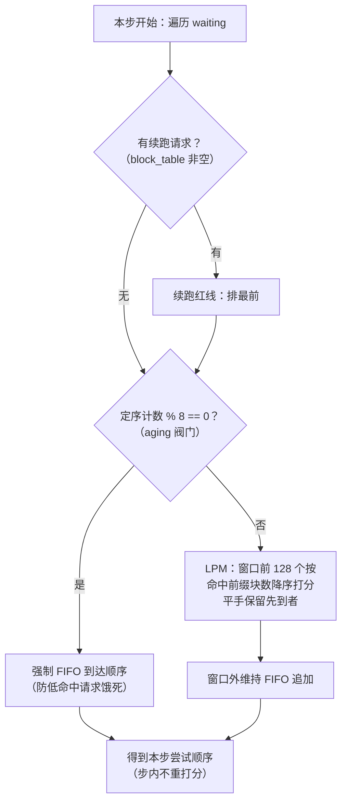

# Cache-Aware Scheduling：LPM 前缀感知调度

> **对应源码中的功能三**。相关文档：[chunked-prefill.md](chunked-prefill.md) · [prefix-cache-lru.md](prefix-cache-lru.md) · [metrics-and-benchmark.md](metrics-and-benchmark.md)

## 动机与问题

有了 Prefix Cache 和 LRU 驱逐（功能二）之后，还剩最后一个浪费源：**出队顺序**。waiting 队列严格 FIFO，而请求的到达顺序与它们的"前缀亲缘关系"无关。

考虑典型场景：64 个不同的系统前缀，请求 round-robin 交错到达（相邻请求命中不同前缀），且前缀工作集超过缓存容量。FIFO 出队时：

- 服务前缀 A 的请求 → A 的块进缓存；
- 接下来 63 个不同前缀的请求依次被服务，A 的块在缓存紧张下被逐步挤出；
- 等轮转回下一个前缀 A 的请求时，缓存里已没有 A → **反复重算**，命中率近乎 0。

问题不在缓存策略（LRU 已尽力），而在**时间局部性被调度器亲手打散**：同前缀请求被均匀摊在时间轴上，每次命中之间都隔着足以把它挤出去的缓存压力。

**方案**：LPM（Longest Prefix Match）调度——prefill 选请求时，优先选"与当前已缓存前缀匹配最长（命中完整块最多）"的等待请求，把同前缀请求在时间上**聚拢**，趁缓存块还没被驱逐把它们成批消化掉。

## 设计方案与取舍

- **默认关闭，零回归**：`enable_cache_aware_schedule: bool = False`（config.py:36）。关闭时 waiting 严格 FIFO 出队，与上游完全一致，作对照基线。
- **与功能一、功能二正交可组合**：`_build_prefill_order()` 在两条调度路径里都被调用——两阶段 `_schedule_two_phase`（scheduler.py:141）和混批 `_schedule_chunked`（scheduler.py:253）；benchmark 的 fifo/lpm 两变体均在 `enable_lru=True` 下跑，唯一变量是出队顺序。三个特性互不耦合，可按需开关。
- **收益有明确边界**：只有"前缀工作集 > 缓存容量"时 LPM 才有发挥空间（缓存装得下时 FIFO 也能命中）。因此默认关，作为显式开关。
- **代价**：LPM 快速排空 prefill 后，更多序列同时进入 decode，单步 decode 变重——实测 TPOT P50 从 5.1ms 升到 8.4ms（见评测节）。这是"prefill 吞吐换 decode 并发"的取舍。

**替代方案及其放弃原因**：

- *全队列 LPM 打分、每挑一条重打分*：精度最高，但每步 O(seqs×W×hash) 的调度开销会吞掉缓存收益（调度器是 CPU 单线程，每步预算以微秒计）；
- *无 aging 的纯 LPM*：低命中请求会被无限插队饿死，生产不可接受；
- *按前缀分组排队*（每个前缀一个子队列）：聚拢更彻底，但要维护分组生命周期、跨组公平性，复杂度远超收益。
- 最终方案（窗口打分 + 每步一次 + aging 阀门）是"收益/开销/公平性"三角上的甜点。

## 实现要点

改动集中在 `nanovllm/engine/scheduler.py` 的定序与出队两处：

| 位置 | 改动 |
|---|---|
| `config.py:36` | 新增 `enable_cache_aware_schedule` 开关 |
| `scheduler.py:20` | 常量 `_LPM_WINDOW = 128`、`_AGING_INTERVAL = 8` |
| `scheduler.py:90` | 新增 `_build_prefill_order()`：三级定序 |
| `scheduler.py:116` | `_remove_from_waiting()`：开启时按 identity O(n) 移除，关闭时 `popleft()` O(1) |
| `block_manager.py:176` | 新增 `count_cached_prefix_blocks()`：无副作用的命中数查询，供打分用 |

**`_build_prefill_order()` 的三级决策**（scheduler.py:90-113）：

1. **续跑红线**：已开始 prefill（`block_table` 非空）的请求排最前，绝不被 LPM 重排晾着——这是功能一分块 prefill 的语义底线，同一时刻至多一条。
2. **aging 阀门**：每 `_AGING_INTERVAL = 8` 步定序，强制走一次纯 FIFO 到达顺序。没有它，一个永远不命中的低命中请求会被源源不断的高命中请求无限插队（饿死）；aging 把它的最坏等待 bound 在 K 步以内。
3. **LPM 打分**：对窗口内（前 `_LPM_WINDOW = 128` 个）fresh 请求按 `count_cached_prefix_blocks(seq)` 降序排序——Python sort 稳定 + reverse，平手保留先到者（局部 FIFO）；窗口外维持 FIFO 追加。

**两处复杂度控制**（决定这个特性是否实用）：

- **每步只打分一次**：`_build_prefill_order` 在一步开头给出完整尝试顺序（O(W×hash)），而不是调度循环里每挑一条就重打分（O(seqs×W×hash)）。安全性依据：新的前缀哈希只在 `postprocess` 的 `hash_blocks` 才登记，**一步之内命中数不变**，重打分结果必然相同，纯属浪费。
- **窗口封顶**：只对前 W=128 个 fresh 请求打分，把每步开销 bound 在与队列深度无关的常量。W 可取较大值（128 ≈ cache_aware 场景的 2 个 round-robin 轮次）而不吞收益。

**打分查询必须无副作用**：`count_cached_prefix_blocks` 与 `can_allocate` 共用 `_match_cached_prefix` 哈希循环（block_manager.py:133），但只返回命中块数——不做分配可行性判断、不 `record_query`、不改任何状态。否则打分本身会污染命中率统计（分母虚增）。

**打分与分配之间的一致性**：定序用的是"此刻"的命中数，真正 `allocate` 时缓存状态没变（同一步内，哈希只在 postprocess 登记）——所以打分结果对本步始终有效，不会出现"按 5 块命中选中、分配时只剩 2 块"的竞态。跨步的失效则由"每步重新定序"天然覆盖。

**`_remove_from_waiting` 的 O(n) 代价**：开启 LPM 后被调度者不一定在队首，需按 identity 从 deque 中间移除（O(n) 指针扫描）。这是有序的必然代价，被两点对冲：n 受 `max_num_seqs` 约束、且移除发生在"确认调度"时（每步至多 max_num_seqs 次），远少于打分省下的重计算。

## 评测

场景设计见 `scripts/bench_metrics.py` 的 `build_cache_aware`（含"FIFO 命中率低的充要条件"推导注释）与 [metrics-and-benchmark.md](metrics-and-benchmark.md)，此处只放结果与解读。

**cache_aware 场景**：64 个不同的 1024-token 前缀，512 条请求 round-robin 交错到达（相邻请求命中不同前缀），`gpu_memory_utilization=0.15` 使前缀工作集超过缓存容量。两变体均 `enable_lru=True`，唯一差别是 `enable_cache_aware_schedule`。

| 指标 | `fifo` | `lpm` | 变化 |
|---|---|---|---|
| 命中率 | 0% | 72.9% | — |
| 驱逐次数 | 1968 | 470 | −76% |
| TTFT P50 | 2894ms | 1773ms | −39% |
| 总耗时 | 5.53s | 3.82s | −31% |

**解读（从数据反推实现）**：

1. **fifo 命中率恰好 0% 是场景构造的充要条件兑现**：round-robin 下同一前缀两次命中的间距 = 前缀总数 64，只要缓存装不下 64 组前缀，FIFO 每次回到某前缀时它已被其余 63 个挤出——`build_cache_aware` 的注释里推导了这个条件，0% 命中率证明它被精确命中。这也让本场景成为 LPM 收益的"最大落差"展示。
2. **72.9% 而非 ~100%**：LPM 窗口 W=128 覆盖约 2 个轮次，窗口内同前缀请求被聚拢消化；但 aging 每 8 步强制 FIFO 一次、窗口外请求不聚拢、以及驱逐仍在发生（470 次），共同构成剩余的 27% 缺口。数字与机制设计一一对应。
3. **驱逐 1968→470（−76%）是聚拢效应的直接度量**：同前缀请求被成批排完后，它们的块在被驱逐前就完成了使命——"重算→被挤→再重算"的循环被打断。驱逐少了，TTFT 随之 −39%（少做的都是重复 prefill）。
4. **代价的呈现**：README 同时记录 TPOT P50 从 5.1ms 升至 8.4ms——LPM 排空 prefill 更快，同时 decode 的序列更多，单步变重。这个数字提醒：该特性用 decode 延迟换 TTFT 与总吞吐，只在"前缀工作集 > 缓存容量"时才值得开，这也是它默认关闭的原因。

**测试入口**：`tests/test_scheduler.py`——`test_cache_aware_selects_high_hit_over_fifo`（LPM 优先高命中）、`test_cache_aware_continues_midprefill_first`（续跑红线）、`test_cache_aware_aging_falls_back_to_fifo`（aging 阀门，`_aging_interval` 暴露为属性供测试调低强制触发）、`test_cache_aware_disabled_equals_fifo`（关闭时零回归）。
