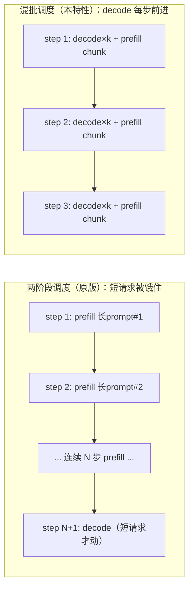

# Chunked Prefill：Prefill/Decode 混批调度

> **对应源码中的功能一**。相关文档：[prefix-cache-lru.md](prefix-cache-lru.md) · [cache-aware-scheduling.md](cache-aware-scheduling.md) · [metrics-and-benchmark.md](metrics-and-benchmark.md)

## 动机与问题

原版 nano-vllm 是**两阶段调度**（`Scheduler._schedule_two_phase`）：一步要么是纯 prefill 批，要么是纯 decode 批，两者互斥，且 prefill 优先。这个策略在请求长度均匀时没有问题，但在真实服务场景里会产生**decode 饥饿**：

- 一批短请求已经进入 decode（每条每步只需要 1 个 token 的算力）；
- 此时到达一批长 prompt 请求，调度器开始连续执行 prefill 步；
- 在**所有**长 prompt prefill 完之前，短请求一个 decode token 都拿不到。

于是短请求的 TPOT（token 间隔）不再是"一步 decode 的耗时"，而是"等完整个 prefill 风暴的耗时"——实测可接近 1 秒（见评测节）。对在线服务而言，这就是用户感知的"卡死"。

## 设计方案与取舍

**方案**：参照 vLLM，把 token 预算（`max_num_batched_tokens`）在同一个 step 内切给两类工作——先给所有 running 序列各排 1 个 decode token，再把剩余预算给 waiting 序列做分块 prefill。长 prompt 被切成 chunk 逐步消化，decode 每步都有机会前进，饥饿从"整个 prefill 风暴"坍缩成"一步"。

**取舍与约束**：

- **默认关闭，零回归**：`enable_chunked_prefill: bool = False`（config.py:27）。关闭时 `schedule()` 走原版 `_schedule_two_phase`，行为与上游完全一致，本身就是 benchmark 的对照基线。
- **混批步放弃 CUDA Graph**：含 prefill chunk 的步形状不定，只能走 varlen + eager 路径；纯 decode 步（waiting 为空）仍走固定形状 CUDA Graph，稳态 decode 性能不损失。
- **prefill 慢一点的代价**：prefill 被 decode token 挤占预算后总步数可能变多，但换来的是 TPOT 的公平性——这是面向延迟公平性（而非极限 prefill 吞吐）的取舍。

**为什么不选更简单的方案**：

- *限制并发 prefill 数*（如一次只 prefill 一条）：缓解但不消除饥饿，长 prompt 仍会独占多个连续步；且浪费了 `max_num_batched_tokens` 预算。
- *优先级调度*（短请求插队 prefill）：只解决"谁先被 prefill"，不解决"已在 decode 的请求被 prefill 风暴饿死"这个本问题。
- 混批是唯一同时保住"prefill 吃满预算"和"decode 每步前进"的方案，也是 vLLM 生产验证过的路线。

## 实现要点

改动集中在 `nanovllm/engine/scheduler.py`，配套少量 `llm_engine.py` / `sequence.py` 变更：

| 位置 | 改动 |
|---|---|
| `config.py:27` | 新增 `enable_chunked_prefill` 开关 |
| `scheduler.py:226` | 新增 `_schedule_chunked()`，混批调度主逻辑 |
| `scheduler.py:346` | `postprocess()` 改为**按序列判定**，支持一步内 prefill/decode 并存 |
| `llm_engine.py:135` | `step()` 按每条序列的 `is_prefill` 分别统计 prefill/decode token 数 |
| `model_runner.py` | 无需改动：混批步复用 prefill 的 varlen 路径 |

**`_schedule_chunked()` 的两段结构**（scheduler.py:226-297）：

1. **阶段一（decode 先行）**：遍历 running，每条排 1 个 token（含抢占处理：缺块时照旧从队尾 preempt）；随后把 decode 序列按原顺序放回 running。
2. **阶段二（剩余预算 prefill）**：`prefill_budget = max_num_batched_tokens - num_decode_tokens`，从 waiting 取请求做分块 prefill，`chunk = min(num_tokens, remaining)`。与两阶段版的关键差异：**混批下总是允许部分 prefill**（scheduler.py:275），不要求"批次为空才切 chunk"。

**三条不变量**：

- **续跑红线**：已开始 prefill（`block_table` 非空）但未完成的请求留在 waiting，下一轮必须优先续上（由 `_build_prefill_order` 的第一级保证，详见 [cache-aware-scheduling.md](cache-aware-scheduling.md)），否则分块续跑语义被破坏。
- **混批步丢采样**：`postprocess()` 逐序列判断 `seq.num_cached_tokens < seq.num_tokens`（scheduler.py:357）——prompt 还没覆盖完的序列本轮的采样结果是垃圾，直接丢弃，下轮继续 prefill；只有 decode 序列和刚 prefill 完的序列才 `append_token`。
- **步类型退化**：`num_prefill_tokens > 0` 才算混批/prefill 步（记 prefill 统计、走 varlen+eager）；waiting 为空时退化为纯 decode 步，走 CUDA Graph。

**执行侧为什么零改动**：混批步全部走 `prepare_prefill` 的 varlen 路径——decode 序列的 `num_scheduled_tokens == 1`，只是"长度为 1 的 query 片段"。每序列取哪个位置的 logits 由 LM head 解决：`layers/embed_head.py:91` 用 `context.cu_seqlens_q[1:] - 1` 取每个变长片段的最后一个位置，天然兼容"有的片段长（prefill chunk）、有的片段长度为 1（decode）"。

**`num_scheduled_tokens` 的生命周期**（混批正确性的会计基础）：

1. 调度时写入：decode 序列 = 1，prefill 序列 = 本步 chunk 大小；
2. `llm_engine.step()` 在 postprocess **之前**按 `seq.is_prefill` 分别求和（llm_engine.py:135-136），得到本步 prefill/decode 各自的 token 数——混批步两者并存，不能再沿用原版"单一 is_prefill 符号区分整步"的假设；
3. `postprocess` 中 `seq.num_cached_tokens += seq.num_scheduled_tokens` 推进缓存进度，然后清零（scheduler.py:353-354）。

**抢占路径不变**：decode 缺块时仍从 running 队尾 `preempt`（scheduler.py:233-237），被抢占者释放全部块、回 waiting 队首，之后靠前缀缓存重算——混批不改变这套机制，只是让"被抢占后等重新 prefill"的请求也能搭上续跑红线。

**`is_prefill` 返回值在混批下的语义**：`schedule()` 返回的布尔不再表示"整步是不是 prefill"，而是告诉 ModelRunner 走哪条执行路径——混批步返回 `True`（走 varlen+eager），纯 decode 步返回 `False`（走 CUDA Graph）。真正的逐序列区分看 `seq.is_prefill`。

## 评测

场景设计（请求构造、种子、显存配置）见 `scripts/bench_metrics.py` 的 `build_starvation` 与 [metrics-and-benchmark.md](metrics-and-benchmark.md)，此处只放结果与解读。

**starvation 场景**：96 条短 victim（输出=2 token）先提交进入 decode，随后 96 条长 blocker（输入 1200–1600 token）制造连续 prefill。`no_mix` = 原版两阶段（`enable_chunked_prefill=False`），`mix` = 混批。Qwen3-0.6B，RTX 5090。

| Victim TPOT | `no_mix`（两阶段） | `mix`（混批） | 变化 |
|---|---|---|---|
| P50 | 552.6ms | 117.2ms | −79% |
| P99 | 822.9ms | 117.6ms | −86% |

**解读（从数据反推实现）**：

1. **victim 的 TPOT 就是饥饿时长本身**。victim 输出恰好 2 个 token，它的 TPOT = 第一个→第二个 token 的唯一间隔。两阶段下这个间隔横跨整个 blocker prefill 风暴（552.6ms），混批下坍缩到 ~117ms（≈一步混批步的耗时，其中绝大部分是 prefill chunk 的算力）。P50 与 P99 几乎重合（117.2 vs 117.6）说明混批后饥饿被**系统性消除**，不存在长尾——这正是"每步 1 decode token"不变量应有的表现。
2. **两阶段的 P99（822.9ms）> P50（552.6ms）** 反映 victim 进入 decode 的时机不同：越早进入的 victim 等的 prefill 步越多。混批把这个方差抹平。
3. 微基准刻意用 0.6B 小模型：收益发生在调度层而非算力层，与模型大小解耦，比例在大模型上同样成立（且长 prompt 场景更常见）。
4. **decode 吞吐没有被牺牲**：混批步中 decode token 只是搭 prefill chunk 的便车（矩阵乘的 batch 维度几乎免费），scheduler 统计里 decode 步数照常累计；稳态（waiting 排空后）退化为纯 decode + CUDA Graph，与原版同速。饥饿的消除没有以稳态吞吐为代价。

**测试入口**：`tests/test_scheduler.py`——`test_chunked_mixed_step`（一步内 decode+prefill 并存）、`test_chunked_postprocess_per_seq`（混批步按序列丢采样）、`test_chunked_pure_decode_when_waiting_empty`（退化纯 decode）、`test_two_phase_never_mixes`（关闭时零回归）、`test_default_behavior_unchanged`。
