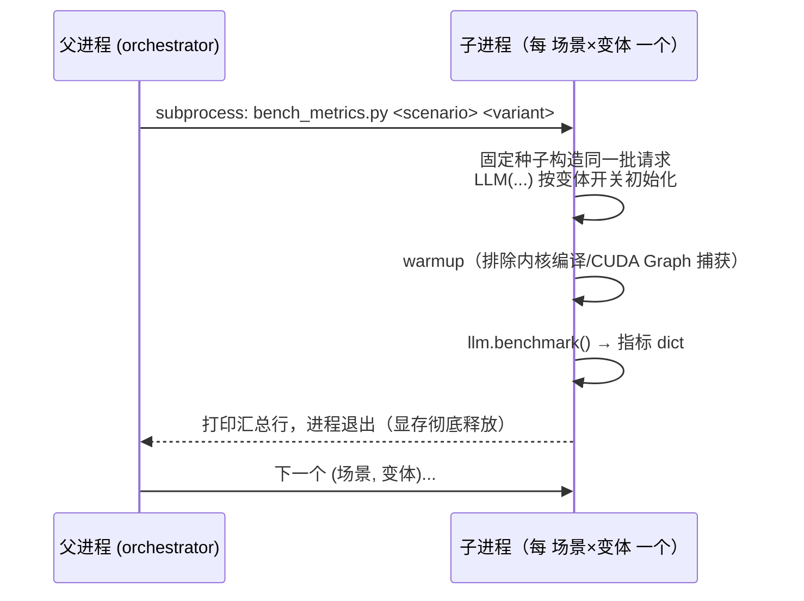

# 运行指标采集与 Benchmark 框架

> **支撑设施**（贯穿功能一~三的采数底座，含功能四预留字段）。相关文档：[chunked-prefill.md](chunked-prefill.md) · [prefix-cache-lru.md](prefix-cache-lru.md) · [cache-aware-scheduling.md](cache-aware-scheduling.md)

## 动机与问题

三个优化特性（混批、LRU、LPM）都作用于调度与缓存层，要证明它们有效，需要一组**口径严格、可对照**的运行指标：TTFT/TPOT 分位数、分阶段吞吐、调度步数组成、缓存命中率与驱逐次数。难点不在"算"，而在：

1. **口径陷阱**：比如"命中率"的分母到底是什么？can_allocate 被反复试探调用时会不会重复计数？混批步里 prefill/decode 并存，吞吐怎么算才与原版口径一致？
2. **测量污染**：benchmark 代码本身不能改变被测行为（如打分查询污染命中统计）；
3. **环境隔离**：多个变体在同一进程连跑会互相污染显存，导致 KV 块数分配被前一个变体影响。

这套设施就是为这三个问题服务的。它**不参与推理**，只为 benchmark 汇总采数。

## 设计方案与取舍

- **统计对象零依赖**：`SchedulerStats` / `PrefixCacheStats` 是纯 dataclass（`engine/metrics.py`），延迟指标是**不依赖 torch 的纯函数**（`percentile` / `compute_ttft` / `compute_tpot`），可在无 GPU 环境单独单测。
- **埋点内聚在引擎层**：统计在 Scheduler/BlockManager 内部顺手记录，通过 `get_stats()` 暴露给 `LLMEngine.benchmark()`；正常 `generate()` 路径不受任何影响（时间戳默认 None，统计累加开销可忽略）。
- **harness 用子进程硬隔离**：每个 (场景, 变体) 单独 fork 子进程跑，进程退出即彻底释放显存——换来的是完全干净的变量控制，代价是无法复用引擎、总耗时更长。

## 实现要点

### 指标口径（`nanovllm/engine/metrics.py`）

| 指标 | 口径定义 | 容易写错的地方 |
|---|---|---|
| `PrefixCacheStats.hit_rate` | 命中块 / 查询块 | 分母是**完整前缀块数（末块不参与）**（`max(seq.num_blocks - 1, 0)`，block_manager.py:213）；末块通常未满、会追加 token，不能作为稳定共享前缀 |
| `PrefixCacheStats.num_evictions` | 真正复写"仍带有效哈希的块"的次数 | 复写无哈希块是零损失复用，**不计驱逐**（block_manager.py:108-110） |
| `saved_tokens` | 命中块数 × block_size | 每个命中完整块省下整块 prefill 计算 |
| `compute_tpot` | (finish − first_token) / (completion_tokens − 1) | 分母是**间隔数**不是 token 数；completion ≤ 1 时无间隔，定义为 0 |
| `compute_ttft` | first_token_time − arrival_time | arrival 在 `add_request` 打点（llm_engine.py:109） |
| `SchedulerStats` | prefill/decode 步数、抢占次数、分阶段 token 数 | 混批步的 decode token 单独累加进 `total_decode_tokens`（scheduler.py:293），保证开/关混批口径一致 |

（`SchedulerStats` 中 `num_speculative_steps` / `record_acceptance` 等为功能四投机解码预留；投机特性尚未完成，本文档不展开。）

### 埋点位置的讲究

- **`record_query` 放 `allocate` 而非 `can_allocate`**（block_manager.py:210-213）：`can_allocate` 会被调度循环反复试探调用，在那里计数会让分母虚增；`allocate` 每条 Sequence 恰好首次分配时调用一次，天然去重。
- **`record_eviction` 放 `_allocate_block`**（block_manager.py:108）：驱逐的精确定义是"复写带有效哈希且索引指向自己的块"，只能在新内容覆盖旧块的那一刻判定。
- **时间戳只留在主进程**：`arrival_time` / `first_token_time` / `finish_time` 不进 `Sequence.__getstate__`（sequence.py:63-68），张量并行的 pickle 通信量不变。
- **混批步吞吐双计**：`LLMEngine.benchmark()` 中混批步的 dt 同时计入 prefill/decode 两侧（llm_engine.py:230-236，注释注明"略偏保守"），非混批步只命中一侧、与原版一致。

### `LLMEngine.benchmark()` 返回字段

| 字段 | 含义 |
|---|---|
| `wall_time_s` | 整批墙钟时间 |
| `ttft_p50_s` / `ttft_p99_s` | TTFT 分位数（逐请求，取 `first_token_time` 非空的序列） |
| `tpot_p50_s` / `tpot_p99_s` | TPOT 分位数（只统计 `tpot > 0` 的序列，即至少 2 个 completion token） |
| `prefill_throughput_tok_s` / `decode_throughput_tok_s` | 分阶段吞吐（token / 阶段累计耗时） |
| `peak_memory_bytes` | 峰值显存（benchmark 前 `reset_peak_memory` 清零，保证是本次峰值） |
| `scheduler_stats` / `prefix_cache_stats` | 上文两个统计对象的引用，harness 直接读字段打印 |

时间戳数据源：`add_request` 打 `arrival_time`，`postprocess` 在首个 completion token 时打 `first_token_time`（scheduler.py:365）、完成时打 `finish_time`（`_finish_seq`）。

### Benchmark harness（`scripts/bench_metrics.py`）

关键设计：

- **子进程隔离**：进程退出即彻底释放显存，避免上一变体的权重/KV Cache 残留导致下一变体分配 KV 块数 ≤ 0（bench_metrics.py:1-2）。变体失败（如 OOM）打印退出码后继续下一个，不中断整轮。
- **固定种子**：所有 `build_*` 函数 `seed(0)`，同场景各变体看到**同一批请求**——对照实验的公平性基础。
- **预热**：`llm.generate(["warmup"], _sp(1))`（bench_metrics.py:184）排除首次内核编译与 CUDA Graph 捕获。
- **用法**：`python scripts/bench_metrics.py [场景] [变体]`；不带参数跑全部，两级参数形式是子进程内部入口。
- **在整条流水线中的位置**：本地 macOS 开发、租 GPU 跑数；`scripts/run_gpu.sh` 依次做 GPU/flash-attn 自检 → prefill/decode 正确性冒烟 → LPM 对齐诊断（证明 LPM 只改准入顺序、不引入额外错误）→ （投机两步，模型缺失时自动跳过）→ 本 benchmark 采数。模型与环境约定集中在 `scripts/env.sh`（MODEL_ROOT 等）。

### 场景清单

目前 **4 个已提交场景**（starvation / prefix / lru_pressure / cache_aware）+ 投机场景（speculative，功能四未完全开发，本文档不覆盖）。场景 → 特性文档的映射：

| 场景 | 对照 | 服务的特性文档 |
|---|---|---|
| `starvation` | `no_mix` vs `mix`（`enable_chunked_prefill`） | [chunked-prefill.md](chunked-prefill.md) |
| `prefix` | `no_reuse` vs `shared`（共享前缀有无） | 上游前缀缓存机制本身，非本扩展特性 |
| `lru_pressure` | `fifo` vs `lru`（`enable_lru`） | [prefix-cache-lru.md](prefix-cache-lru.md) |
| `cache_aware` | `fifo` vs `lpm`（`enable_cache_aware_schedule`，均开 LRU） | [cache-aware-scheduling.md](cache-aware-scheduling.md) |

每个场景都遵循同一构造原则：**隔离单一变量**——同场景各变体的请求批、种子、显存、`enable_lru` 等其余开关全同，只翻目标开关。`build_cache_aware` 的注释里甚至给出了"FIFO 命中率低的充要条件"推导（同前缀命中间距 ≥ 缓存可容纳的前缀组数），并给出判据：若 fifo 变体 evictions 为 0（缓存仍装得下），就把 `gpu_memory_utilization` 再往下压。

## 评测

本篇是采数设施，自身的"评测"就是各特性篇引用的四张结果表（数值见 README Benchmark 节与各特性文档）。这里只验证设施本身的正确性：

- **口径可单测**：`tests/test_metrics.py` 在无 GPU 环境单测 `percentile`（线性插值分位数）、`compute_tpot` 边界（completion ≤ 1 返回 0）、`SchedulerStats`/`PrefixCacheStats` 累加与派生属性。
- **埋点不污染被测量**：LPM 打分用的 `count_cached_prefix_blocks` 不 `record_query`（见 [cache-aware-scheduling.md](cache-aware-scheduling.md)），由 `tests/test_scheduler.py` 覆盖。

**测试入口**：`tests/test_metrics.py`、`tests/test_block_manager.py`（驱逐计数口径）、`tests/test_scheduler.py`（步数统计）。
