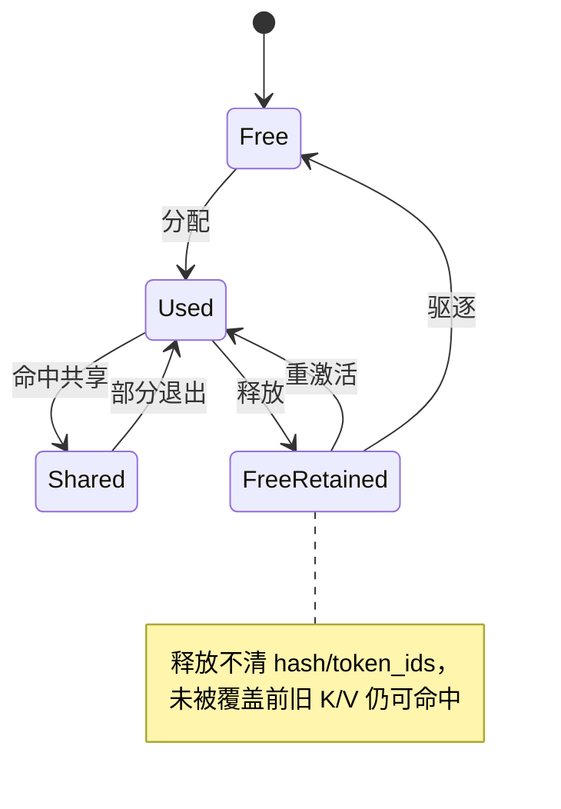

# Prefix Cache 增强：LRU 驱逐策略

> **对应源码中的功能二**。相关文档：[chunked-prefill.md](chunked-prefill.md) · [cache-aware-scheduling.md](cache-aware-scheduling.md) · [metrics-and-benchmark.md](metrics-and-benchmark.md)

## 动机与问题

前缀缓存（Prefix Cache）是上游已有机制：完整 KV 块按"链式累计前缀哈希"登记索引，同前缀请求直接复用物理块、跳过重复 prefill。它的基础收益（共享系统前缀下命中率 0% → 88.3%、TTFT −58%）见 README 的 `prefix` 场景，属于上游机制，本文不复述。

**本文讲的是我们新增的增量：驱逐策略。** 上游的 Prefix Cache 用 deque 做空闲队列，块满后的复写顺序是 **FIFO**——最久之前释放的块最先被覆盖。问题在于"释放先后"与"缓存价值"无关：

- 一个刚从热点前缀退出的块（很可能马上又被命中），和一个从不参与缓存的 decode 尾块（`hash == -1`，无任何复用价值），在 FIFO 下地位平等；
- 缓存紧张时，热点前缀块会被无关请求按释放顺序无差别复写，之后再被同前缀请求重算——驱逐打在了最不该打的地方。

## 设计方案与取舍

**方案**：把驱逐策略从 FIFO 换成显式 **LRU**，并让"无缓存价值的块"永远排在复写顺序的最前面。核心思想：**驱逐应优先消耗零价值块，把真正的缓存驱逐推迟到显存真正不足时，且牺牲最久未命中的那块**。

**注意：本特性的默认值与其他开关不同**——`enable_lru: bool = True`（config.py:30），**默认开启**（chunked/cache-aware/speculative 三个开关均默认 False）。方向是反的：`enable_lru=False` 才是回退到原版 FIFO 的**对照基线**。设计判断是 LRU 实现开销极小（OrderedDict O(1) 操作）、无正确性风险、在缓存充裕时与 FIFO 等价，因此可以安全地默认开。

**取舍**：LRU 不改变正确性（复写前都会校验 ref_count 和哈希索引），只改变"牺牲谁"的选择；收益大小取决于工作负载的复用偏斜度——完全无复用的负载下两者等价，偏斜越明显 LRU 越占优。

**为什么是"释放序 + 无哈希优先"，而不是严格 LRU**：严格 LRU 需要在每次**命中**时更新块的新近度（把命中块移到队尾）。但这里的空闲队列只装 `ref_count == 0` 的块——正在被使用的共享块根本不在队列里，它们的"新近度"无处记录。而实践上"释放先后"已是"使用新旧"的良好近似（最后释放的块刚被用完）。于是用零额外开销的释放序近似 LRU，再把唯一明确的信号——"这个块连哈希都没有，复写零损失"——用 `move_to_end(last=False)` 显式编码进队列序。这是用两个 O(1) 操作换取严格 LRU 的绝大部分收益。

## 实现要点

改动集中在 `nanovllm/engine/block_manager.py`，以及配套统计（`engine/metrics.py` 的 `PrefixCacheStats`）：

| 位置 | 改动 |
|---|---|
| `config.py:30` | 新增 `enable_lru` 开关（**默认 True**） |
| `block_manager.py:67` | 空闲队列从 deque 换成 `OrderedDict[int, None]` |
| `block_manager.py:117` | `_deallocate_block()` 增加 LRU 序维护 |
| `block_manager.py:94` | `_allocate_block()` 统一从队首取块 + 驱逐计数 |
| `metrics.py:80` | `PrefixCacheStats`：命中率/驱逐/节省 token 统计 |

**OrderedDict 空闲队列的两端语义**（这是整个特性的核心）：

- **队尾 = 最近释放端**：`_deallocate_block` 回插到队尾（`free_block_ids[block_id] = None`）。
- **队首 = 优先复写端**：`_allocate_block` 统一 `next(iter(...))` 从队首取。
- FIFO 模式下这与原 deque 完全等价（最久释放的在队首）。
- LRU 模式下多一步：释放时若块**无哈希**（`hash == -1`，decode 尾块等无缓存价值的块），`move_to_end(block_id, last=False)` 把它直接推到**队首**（block_manager.py:125-126）。于是队首优先消耗零价值块，带哈希的缓存块沉在队列后部，按"释放先后"近似 LRU 序被保留。

**释放不清哈希**：`_deallocate_block` 故意保留 `block.hash` 和 `token_ids`（block_manager.py:128-129）——物理块未被覆盖前旧 K/V 仍有效，后续请求可直接"重激活"。命中闲置缓存块时，OrderedDict 支持按 id O(1) 删除（`del self.free_block_ids[block_id]`，block_manager.py:199），优于原 deque.remove 的 O(n) 扫描——这也是换 OrderedDict 的直接动机。

**驱逐的精确定义**：`_allocate_block` 复写一个块时，仅当它仍带有效哈希且索引指向自己（`hash_to_block_id.get(block.hash) == block_id`）才删除索引并 `record_eviction()`（block_manager.py:108-110）。复写无哈希块不算驱逐——这是"零损失复用"，不计入。

**链式累计哈希**（上游机制，与驱逐正交但共同构成缓存正确性）：`compute_hash` 先写入前一块的哈希再写当前块 token（block_manager.py:87-91），保证"第二块内容相同但第一块不同"不会误判命中；命中后还比对实际 `token_ids`（block_manager.py:149）防哈希碰撞。

**命中块挂载的两种情形**（`allocate`，block_manager.py:187-201）：命中的块若**正在被其他 Sequence 使用**（在 `used_block_ids` 中），`ref_count += 1` 直接共享，不消耗空闲名额；若**闲置在空闲队列**（旧 K/V 仍有效但未被使用），则从空闲队列 O(1) 摘除、`ref_count = 1` 重激活。这个区分也体现在 `can_allocate` 的账目里（block_manager.py:168-172）：只有"使用中"的共享块能从新块需求中减掉，闲置重激活仍占一个空闲名额。

**哈希登记时机**：新填满的完整块由 `hash_blocks` 在 postprocess 时登记进 `hash_to_block_id`（block_manager.py:259-278）——这意味着**一步之内命中数不变**，这个性质被功能三的"每步只打分一次"优化依赖（见 [cache-aware-scheduling.md](cache-aware-scheduling.md)）。

变迁明细（图上的短标签 ↔ 代码行为）：

- **分配**：`_allocate_block` 从空闲队首取出并 `reset`（hash=-1）；
- **命中共享**：同前缀请求命中"使用中"的块，`ref_count++` 直接共享；
- **部分退出**：部分使用者离开，`ref_count` 仍 > 0，块不释放；
- **释放**：`ref_count=0` 回空闲队列队尾，**保留 hash/token_ids**；LRU 模式下无哈希块被 `move_to_end(last=False)` 推到队首，优先被复写；
- **重激活**：命中闲置缓存块，O(1) 从空闲队列摘除（`del free_block_ids[block_id]`），`ref_count=1`；
- **驱逐**：复写仍带有效哈希且索引指向自己的块，删 `hash_to_block_id` 索引并 `record_eviction()`——只有这种复写才算驱逐。

## 评测

场景设计见 `scripts/bench_metrics.py` 的 `build_lru_pressure` 与 [metrics-and-benchmark.md](metrics-and-benchmark.md)，此处只放结果与解读。

**lru_pressure 场景**：128 个不同的 512-token 前缀（各 2 个完整块），384 条请求按幂律偏斜复用（`random()**2` 偏向热点前缀），`gpu_memory_utilization=0.4` 人为制造缓存紧张。`fifo`（`enable_lru=False`）vs `lru`（默认）。

| 指标 | `fifo` | `lru` | 变化 |
|---|---|---|---|
| 命中率 | 60.4% | 62.5% | +2.1pp |
| 驱逐次数 | 82 | 62 | −24% |

**解读（从数据反推实现）**：

1. **驱逐 −24% 是机制的直接指纹**：LRU 模式下零价值块（decode 尾块）被推队首先牺牲，82→62 的差值 ≈ FIFO 下被误伤复写的缓存块数量。驱逐少了，热点前缀块活得更久，于是命中率 +2.1pp——两个数字是同一枚硬币的两面，互为因果验证。
2. **增量不大是符合预期的**：lru_pressure 的驱逐压力有限（0.4 显存），且 FIFO 的"释放序"在持续负载下本就近似"使用序"。LRU 的价值在更紧张的缓存与更偏斜的复用下放大；本场景证明的是"方向正确且无副作用"。
3. 真正考验"缓存不够用"时调度与驱逐配合的场景是 `cache_aware`，那是功能三的舞台（见 [cache-aware-scheduling.md](cache-aware-scheduling.md)，其两变体均开 LRU，只改出队顺序）。

**测试入口**：`tests/test_block_manager.py`——`test_lru_prefers_nohash_then_evicts_oldest`（LRU 先消耗无哈希块、再驱逐最旧缓存块）、`test_fifo_fallback_ignores_nohash_priority`（FIFO 基线行为）、`test_prefix_hit_reactivation_and_stats`（命中重激活与统计口径）。
